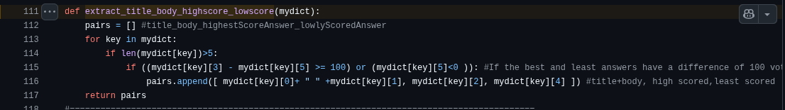

# Introduction

Previously, I carried out the exercise of implementing a RAG system using 750 synthetically generated support tickets, leveraging their resolution records and consuming several Knowledge Bases centered around them to answer Level 1 IT support questions — such as networking, infrastructure, mobility, cybersecurity issues, and the like.

While the experiment was successful in that I built a functional RAG system from scratch, along with its agentic variant, the evaluation metrics were quite poor. Faced with this scenario, several possible causes came to mind: a poor chunking strategy, LLMs that were too cheap for the augmentation and generation stages, low embedding dimensionality, an architecture that tried to find answers in the wrong places, among many other potential reasons that could turn what seemed like a trivial implementation of this technique into a failed experiment.

But what if the problem lies in the synthetic data? This question arose when, drawing on my academic background, I found myself advising teams facing similar issues. I revisited my experience with this demo project and began to question my initial strategy of iteratively making improvements and progressively evaluating results.

In the real world, I have worked with real data. Real data has its problems, but it also provides mechanisms to evaluate it in a way that is equally realistic. Data generated by LLMs can suffer from both hallucinations and a level of perfection that the real world does not contain — turning simple metrics into unattainable chimeras.

That is why, before desperately trying to fix each RAG issue one by one — applying improvements and measurements across all possible variants and hyperparameters of this retrieval and generation architecture — I decided to be honest with myself about a system meant to provide useful answers to realistic questions. The time has come, then, to investigate whether there exists a real-world dataset that fits the problem and allows this application to answer real questions.

# In Search of a Real-World Dataset

Several public datasets are available on the web that could help build a realistic version of this solution. After evaluating different options, the one that caught my interest the most was the Hugging Face dataset [`flax-sentence-embeddings/stackexchange_titlebody_best_and_down_voted_answer_jsonl`](https://huggingface.co/datasets/flax-sentence-embeddings/stackexchange_titlebody_best_and_down_voted_answer_jsonl).

This dataset contains 210,000 question-answer pairs automatically extracted from the [Stack Exchange](https://stackexchange.com/) platform, of which about 60,000 pairs correspond to discussion threads on IT-related topics (which is the target of this RAG), so we could use only those.

| Community | Pairs |
|-----------|-------|
| superuser | 17425 |
| askubuntu | 9975 |
| serverfault | 7969 |
| apple | 6696 |
| unix | 6173 |
| security | 3069 |
| android | 2830 |
| dba | 2502 |
| webapps | 1906 |
| sharepoint | 1691 |
| networkengineering | 476 |
| devops | 53 |

Of the approximately 60,000 IT questions, almost half come from the `superuser` and `askubuntu` sub-forums, while the rest are distributed across the other 10 sub-forums. This is relevant because later we may find it useful to filter by sub-forum, allowing us to build either a RAG specialized in a particular topic or a more general one covering all IT support topics.

## Dataset Description

The dataset provides only three columns:

1. `title_body` — the thread title and the description given by its creator seeking answers.
2. `upvoted_answer` — the most upvoted answer from the community. This column is key because it will serve as our realistic answer to the user's problem — our *ground truth* when evaluating the RAG.
3. `downvoted_answer` — the worst answer in the entire thread.

These three columns are joined by a fourth one indicating which Stack Exchange sub-forum the discussion thread belongs to (`community`).

It goes without saying that the relevant columns are the first two, while the third could be useful for running some contrastive learning experiments, and the fourth allows us to filter by sub-forum.

## How Good Is This Dataset?

A key feature of this dataset is that it filters out any question where the highest-voted answer does not have a vote margin of at least 100 positive votes over the second-best answer, or where the worst answer has a negative score. This is a double-edged sword for our goal of building a RAG with this data: if we consider an edge case where a question only has negative answers, it could still be included as long as the least-bad answer outperforms the worst one by 100 votes or more.

Source: https://github.com/nreimers/flax-sentence-embeddings/blob/de583831d9b8b3454ed62fb74f783380ab2e933b/datasets/stackexchange/transforms.py#L111

Since the current dataset does not include a column with the score of the selected answer — and therefore we cannot apply the rule that the score must be positive — and computing those scores would require downloading 25 GB of data (which is overkill for what is ultimately an edge case), we propose conducting an exploratory data analysis of the dataset to determine what improvements can be implemented by filtering out question-answer pairs that are irrelevant or do not contribute significantly to the answers the system can generate.

This is key for another aspect of this type of system: when we have such a large number of possible questions, inserting them into a vector space may cause the K nearest neighbors retrieved by the RAG to not be the best ones, potentially retrieving garbage answers arising from noise in the dataset. At the same time, a more densely populated vector space requires longer distance computation times and consequently increases retrieval latency. For these reasons, we want to control the quality-latency trade-off by finding ways to improve the quality of the data we keep in the vector database.

Beyond the fact that an Exploratory Data Analysis should always be performed when obtaining a new dataset, it would also be useful to measure how many questions have technical answers suitable for an IT support context. If after this analysis we find that the topic coverage is broad, we can conclude that the dataset is worth using for the problem we aim to solve.

# Summary

This post outlines a path to address changes to a RAG experiment that was successful in its implementation phase but did not achieve acceptable evaluation metrics.

Before embarking on the typical recommended improvements to boost metrics, we hypothesize that the root cause lies in the raw material: the 750 synthetic support tickets used to answer user questions may be insufficient or too rigid for the stated goal.

Since we do not have access to a corporate enterprise ticket database, it is appealing to try building the same system using answers from public internet forums. There is a Hugging Face dataset that suits our case, but questions naturally arise regarding its quality and relevance for the application we aim to build.

As part of this article, we introduced the problem and the various steps to address it. In the following article, we will investigate the quality of the proposed corpus and discuss different mechanisms to improve it without losing topic generality, along with the decision on the minimum quality required to consider it a viable replacement for synthetic data.

# References

- [flax-sentence-embeddings/stackexchange_titlebody_best_and_down_voted_answer_jsonl](https://huggingface.co/datasets/flax-sentence-embeddings/stackexchange_titlebody_best_and_down_voted_answer_jsonl)
- [Stack Exchange](https://stackexchange.com/)
- Original post about the collaborative hackathon organized by Hugging Face and Google Cloud in 2021 to train sentence embeddings with this data: [Train the Best Sentence Embedding Model Ever with 1B Training Pairs](https://discuss.huggingface.co/t/train-the-best-sentence-embedding-model-ever-with-1b-training-pairs/7354)
- Blog post about the hackathon results on the Hugging Face blog: [Train a Sentence Embedding Model with 1 Billion Training Pairs](https://huggingface.co/blog/1b-sentence-embeddings)
