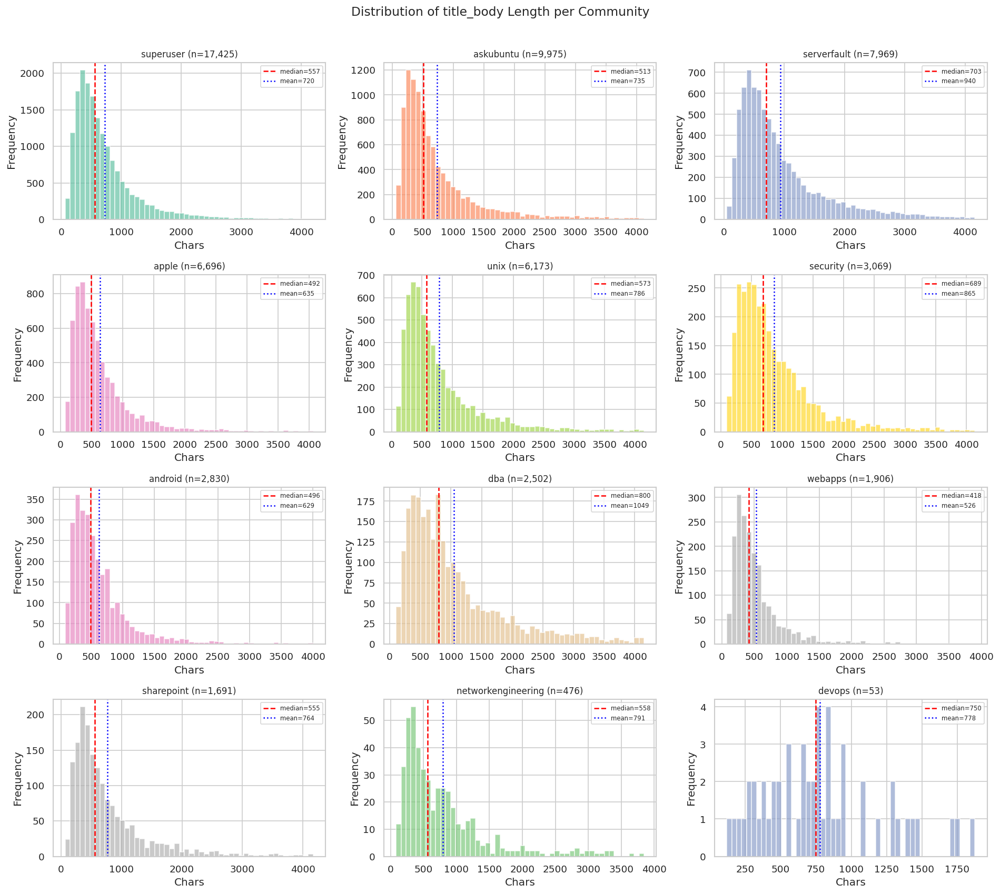
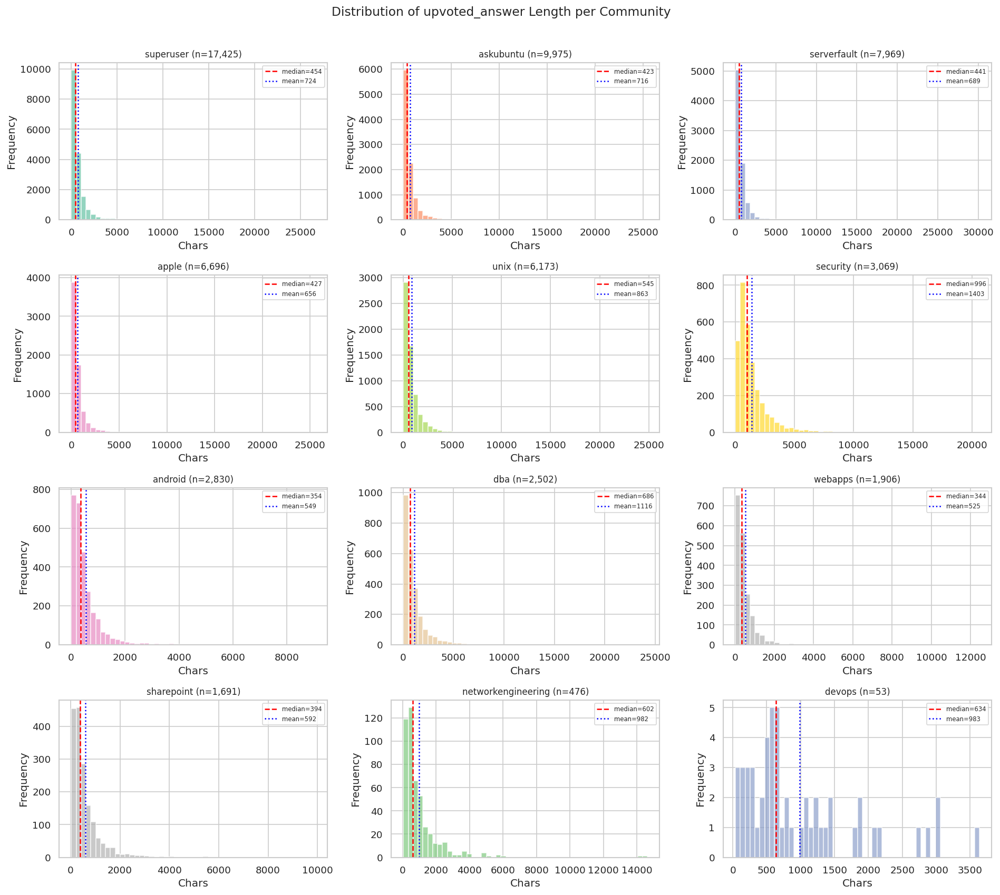
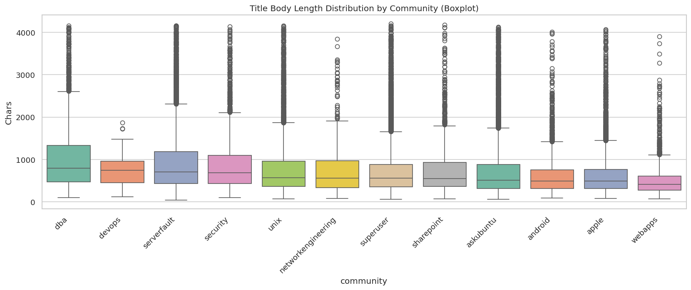
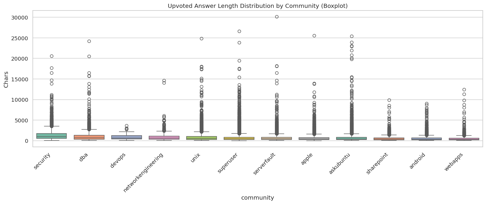
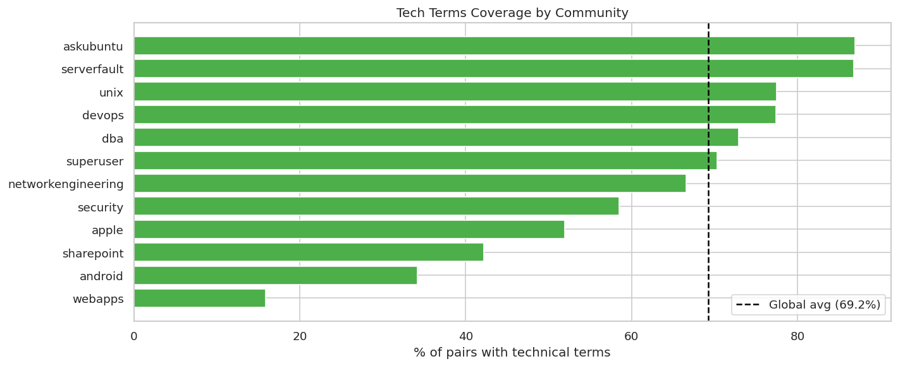
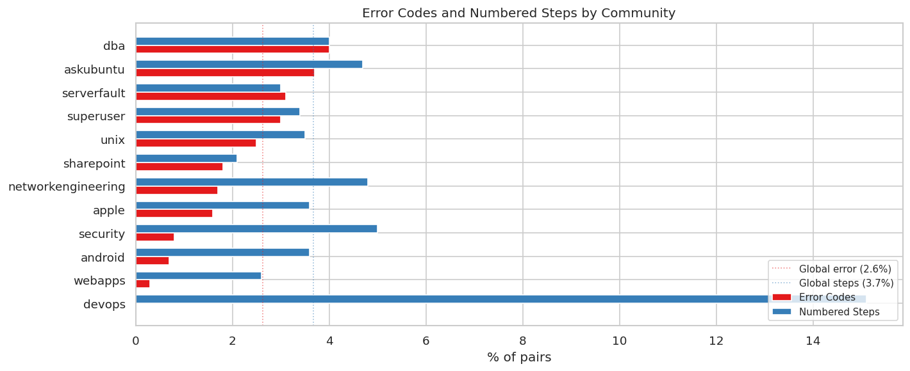
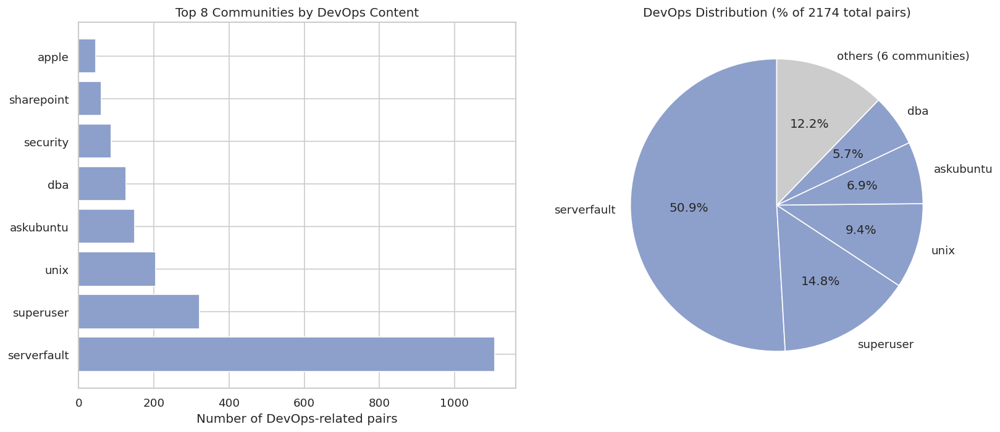
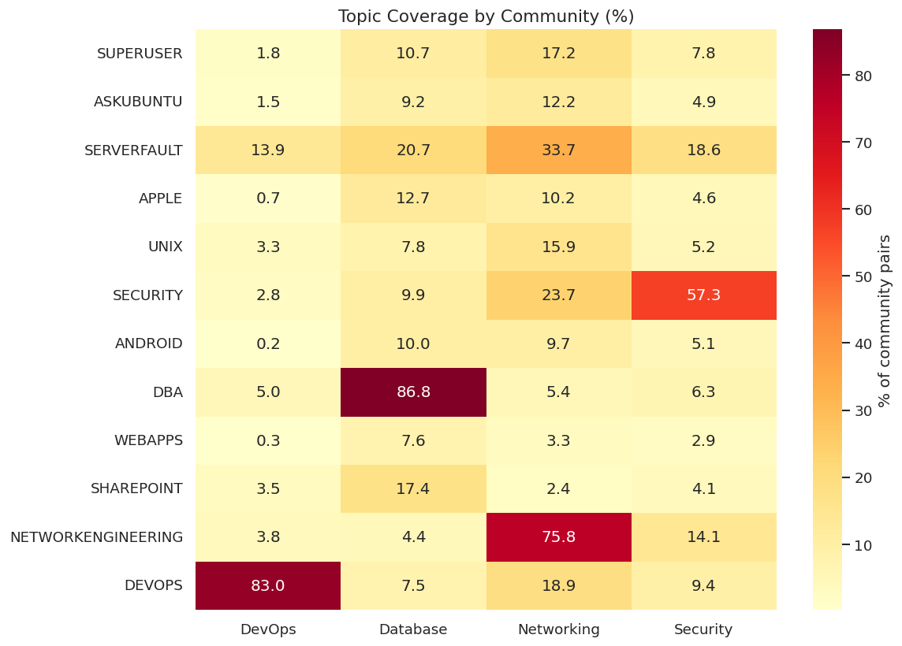
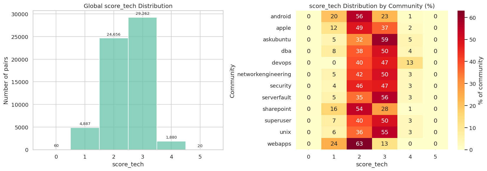
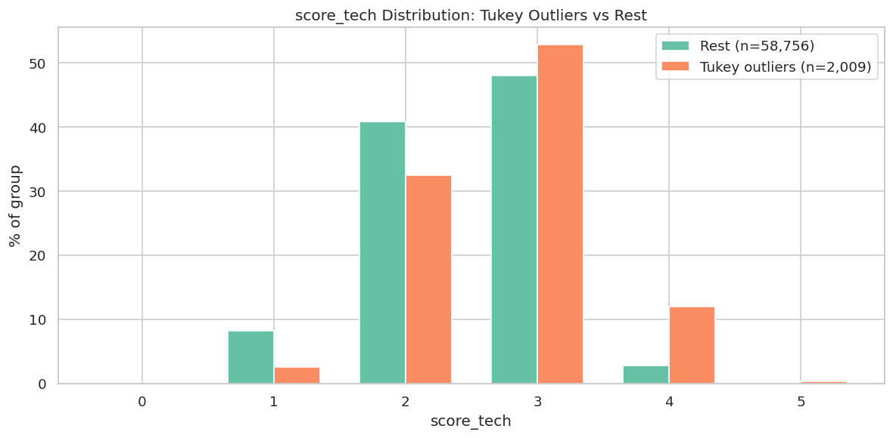

# Introducción

En el [pasado artículo](../0_dataset_migration_intro/dataset_migration_intro_es.md) se introdujo una propuesta de cambio para un sistema de generación de soluciones de problemas de soporte IT de nivel 1: cambiar de datos generados sintéticamente que puedan resultar demasiado rígidos a la hora de evaluar, a datos reales extraídos de foros sobre la temática de interés. 

Siempre que se trata con un conjunto de datos del mundo real, debe hacerse un análisis exploratorio sobre los mismos que confirme o rechace la hipótesis de que resulten útiles para el problema que se busca resolver utilizándolos. Eso es lo que trataremos en el presente informe.

El análisis documentado aquí se realizó por medio del Jupyter Notebook disponible [aquí](../../notebooks/eda_stackexchange_corpus.ipynb).

# Análisis inicial de los datos: ¿Tenemos datos suficientes para todas las categorías?

### Volumen por comunidad


<center>

| Community | Pares |
|-----------|-------|
| superuser | 17425 |
| askubuntu | 9975 |
| serverfault | 7969 |
| apple | 6696 |
| unix | 6173 |
| security | 3069 |
| android | 2830 |
| dba | 2502 |
| webapps | 1906 |
| sharepoint | 1691 |
| networkengineering | 476 |
| devops | 53 |

</center>

En la tabla podemos ver que la cantidad de hilos por comunidad es muy desigual. Por ejemplo, la comunidad `devops` tiene tan solo 53 hilos, mientras que `superuser` tiene 20.000. Esto nos hace preguntarnos si la cantidad de datos es suficiente para todas las categorías y si la calidad de los mismos es adecuada para el problema que queremos resolver. 

### ¿Son suficientes los datos?

Sin embargo, el hecho de que solo dos comunidades tengan menos de 1000 hilos nos indica que la mayoría de las categorías están bien representadas y que el sistema debería poder responder preguntas de soporte IT de nivel 1 con un buen desempeño. Más tarde evaluaremos qué hacemos con `devops` y `networking`, que son las dos comunidades con menos de 1000 hilos, para ver si podemos mejorar la calidad de las respuestas en esas categorías.

# Longitudes de pregunta y respuesta

### Distribución global

Se analizaron las longitudes de las preguntas y respuestas, con el objetivo de saber:
- El largo típico de las mismas según comunidad
- Si existen _outliers_ extremos que justifiquen un acortado de las mismas
- Si en el conjunto de datos donde se filtraron respuestas que no destacaban (menos de 100 upvotes de distancia entre la mejor y la peor), aún persisten respuestas también cortas. Si eso ocurre, podríamos estar obteniendo en la búsqueda semántica pares pregunta-respuesta de baja calidad que solo aportan ruido a la etapa de generación.

<div align="center">

<table>
<tr>
<td>

| Estadístico | title_body |
|------------:|-----------:|
| count | 60765.00 |
| mean | 761.03 |
| std | 630.83 |
| min | 47.00 |
| 25% | 354.00 |
| 50% | 563.00 |
| 75% | 928.00 |
| max | 4199.00 |

</td>
<td>

| Estadístico | upvoted_answer |
|------------:|---------------:|
| count | 60765.00 |
| mean | 759.20 |
| std | 1064.64 |
| min | 0.00 |
| 25% | 244.00 |
| 50% | 467.00 |
| 75% | 887.00 |
| max | 30141.00 |

</td>
</tr>
</table>

</div>


Evitando aún meternos en la división por comunidades, observamos que la longitud de las preguntas y respuestas es bastante heterogénea, con una media de preguntas y respuestas muy similar: alrededor de 760 caracteres. Lo interesante surge cuando analizamos la distribución de las longitudes de las preguntas y respuestas, donde podemos ver que la desviación estándar de respuestas es bastante más alta que la de las preguntas, algo verosímil ya que las descripciones de los problemas podrían ser más estructuradas que las eventuales respuestas, que pueden resultar muy complejas o tan simples como "prendé y apagá el _access point_". 

Al apreciar una desviación estándar alta, resulta necesario también ver otras métricas de distribución como los cuartiles. Si miramos la distancia intercuartílica, confirmamos lo anterior: el largo de las respuestas es más impredecible que el de las preguntas. Sin embargo, al mirar las medianas , apreciamos algo curioso: la pregunta típica tiene 100 caracteres más que la respuesta típica (563 vs 467), algo que atenta contra la intuición de que las preguntas son más cortas que las respuestas. 

¿Cómo puede suceder esto? Veamos los máximos de cada distribución: mientras que las preguntas se cortan en alrededor de 4000 caracteres, las respuestas ascienden a 30.000. Esto termina haciendo que la media se dispare en relación a la mediana, lo que nos indica que estamos ante una distribución de respuestas no simétrica (la mayoría de las muestras a la izquierda de la media y algunas poco comunes a la derecha).

<center>

| Percentile | Question (chars) | Answer (chars) | Difference |
|---|---|---|---|
| P25 | 354 | 244 | +110 |
| **P50 (median)** | **563** | **467** | **+96** |
| P75 | 928 | 887 | +41 |
| Max | 4,199 | 30,141 | **-25,942** |

</center>

### Un hallazgo inesperado: la log-normal

La forma de la distribución de respuestas — cola larga a la derecha, mayoría de muestras a la izquierda — sugería una distribución log-normal. Ajustamos una log-normal a las longitudes de respuesta y aplicamos el test de Kolmogorov-Smirnov para validar el ajuste. El resultado: $p = 0.04$. No podemos rechazar la hipótesis de que las respuestas siguen una log-normal a un nivel de confianza del 95%, aunque está en el borde. Es una aproximación razonable, no una certeza.

¿Para qué sirve saber esto? Porque podemos planificar costos de inferencia sin haber ejecutado una sola consulta. El percentil 75 de las respuestas está en 887 caracteres. El 75% de las consultas que hagamos al sistema van a recuperar respuestas por debajo de ese umbral. Si usáramos un modelo barato (p. ej. `ling-2.6-flash`, ~$0.03/M tokens de salida) para ese 75% y reserváramos uno más capaz (p. ej. `deepseek-v4-flash-0731`, ~$0.18/M tokens de salida) para el 25% restante, el costo estimado por cada 1000 consultas se reduciría en un orden de magnitud similar al ~68% calculado originalmente con los modelos de la época. Los modelos concretos y el ahorro real se evaluarán empíricamente en la fase de optimización de costos; este hallazgo solo establece que la oportunidad existe y que los datos ya nos dan un punto de partida.

No estamos decidiendo qué modelo usar. Es una nota al margen: cuando llegue el momento de poner esto en producción, los datos ya nos dan un punto de partida para la discusión sobre costos.

### Asimetría e implicaciones para chunking

Si miramos la tabla anterior, vemos que el 75% de las preguntas se encuentran por debajo de los 1000 caracteres y el máximo absoluto es de 4199 caracteres. Esto nos sugiere que realizando un _chunking_ de 1000 caracteres, la mayoría de las preguntas se mantendrían en un solo _chunk_, mientras que las más largas se dividirían en 4 _chunks_ como máximo. Definir una estrategia de _chunking_ para la etapa de ingestión de datos puede basarse en este hallazgo, algo a validar llegado ese momento.

# Diferencias de longitud de preguntas y respuestas según comunidad

### Observaciones por comunidad

Lo primero que resulta interesante analizar son las medianas de longitud de preguntas y respuestas entre distintas comunidades. Si miramos la tabla siguiente, apreciamos que aquellas comunidades con nombres más técnicos (como `dba`, `serverfault` y `security`) destacan por tener las preguntas y/o respuestas típicas más largas. Por otro lado, `webapps`, `android` y `apple` destacan por tener el ratio de longitud de pregunta/respuesta más bajo.

<center>


| Longer questions | Longer answers | Shorter pairs |
|---|---|---|
| dba: 800 | security: 996 | webapps: 418 / 344 |
| serverfault: 703 | dba: 686 | android: 496 / 354 |
| security: 689 | networkengineering: 602 | apple: 492 / 427 |

</center>

Todo lo anterior parece apuntarnos hacia algo coherente: comunidades con nombres más técnicos discuten temáticas más técnicas y por lo tanto tienden a tener preguntas y respuestas más largas que aquellas donde se discuten problemas generalistas. 

<div align="center">

| Comunidad | total_pairs | mean_q_len | median_q_len | mean_a_len | median_a_len |
|----------:|------------:|-----------:|-------------:|-----------:|-------------:|
| superuser | 17425 | 720.4 | 557.0 | 723.6 | 454.0 |
| askubuntu | 9975 | 734.6 | 513.0 | 715.7 | 423.0 |
| serverfault | 7969 | 939.6 | 703.0 | 689.1 | 441.0 |
| apple | 6696 | 635.4 | 492.0 | 656.3 | 427.0 |
| unix | 6173 | 785.5 | 573.0 | 862.7 | 545.0 |
| security | 3069 | 865.5 | 689.0 | 1402.8 | 996.0 |
| android | 2830 | 629.2 | 495.5 | 549.0 | 354.0 |
| dba | 2502 | 1048.6 | 799.5 | 1115.9 | 686.0 |
| webapps | 1906 | 525.6 | 418.0 | 525.5 | 344.0 |
| sharepoint | 1691 | 764.2 | 555.0 | 592.3 | 394.0 |
| networkengineering | 476 | 790.8 | 558.0 | 981.9 | 601.5 |
| devops | 53 | 778.1 | 750.0 | 983.2 | 634.0 |

</div>

### Histogramas y gráficos de cajas

<div align="center">


&emsp;&emsp;


</div>

Observando las gráficas podemos confirmar lo que ya se sospechaba con los datos de distribución: nos encontramos ante distribuciones no-simétricas, con colas largas a la derecha. Esto es más evidente en las respuestas que en las preguntas, donde la mayoría de las muestras se encuentran a la izquierda de la media y algunas pocas muestras se encuentran a la derecha de la media. Lo mismo puede observarse con los siguientes gráficos de cajas.

<center>


&emsp;&emsp;


</center>

# Detección de términos técnicos

### Metodología

Para detectar la presencia de contenido técnico se usan **tres señales binarias** independientes, cada una aplicada con una expresión regular:

<center>

| Señal | ¿Qué detecta? | ¿Dónde se aplica? |
|-------|--------------|-------------------|
| `has_error_code` | Códigos de error hexadecimales (`0x...`), números de error (`Error 123`) y prefijo `ERROR:` | Pregunta (`title_body`) |
| `has_numbered_steps` | Pasos numerados (`1.`, `2.`), viñetas, "Step N:", "First:", "Then:" | Respuesta (`upvoted_answer`) |
| `has_tech_terms` | Diccionario de 48 términos IT (server, network, database, docker, kubernetes, firewall, vpn, ssh, api, deploy, cluster, linux, windows, etc.) | Pregunta (`title_body`) |
</center>

### Resultados

<center>



</center>


Sería de esperar que el conjunto de datos tenga un porcentaje de pares pregunta-respuesta alto, dado que nos quedamos con aquellas que resultaban de interés para soporte IT. Además, las comunidades con nombres más técnicos deberían tener un porcentaje de pares pregunta-respuesta con términos técnicos más alto que aquellas comunidades más generalistas.

<center>



</center>

Por otra parte, las definiciones que toman como referencia para detectar términos técnicos son bastante estrictas, por lo que es de esperar que el porcentaje de pares pregunta-respuesta con términos técnicos sea menor al 100% en todas las comunidades. 


### Interpretación

Lo que se puede apreciar de los gráficos es lo esperado: el promedio de términos técnicos de todo el conjunto de datos es de aproximadamente 70% y, en general, las comunidades más técnicas tienen un porcentaje de pares pregunta-respuesta con términos técnicos más alto que aquellas comunidades más generalistas, algo que sospechábamos en la sección anterior. Respecto a las otras aproximaciones a tecnicalidad, podemos ver que la presencia de códigos de error es baja en todas las comunidades y mucho más baja cuando hablamos de comunidades generalistas. En relación a lo atípico del gráfico de la comunidad `devops`, omitamos realizar comentarios: la baja cantidad de pares está detrás de la incoherencia con el resto de las comunidades.

En resumen: se trata de un conjunto de datos con un porcentaje de pares pregunta-respuesta con términos técnicos alto, lo que nos indica que el sistema debería poder responder preguntas de soporte IT de nivel 1 con un buen desempeño. Además, si quisiéramos filtrar por comunidades más técnicas o generalistas, podríamos obtener candidatos a partir de este análisis.

# Solapamiento de categorías y comunidades

### El caso de devops

Como se dijo al principio, donde se presentó la tabla con la cantidad de hilos que tiene cada comunidad, la comunidad `devops` presenta números peligrosamente bajos: tan solo 53 ejemplos. Con esos guarismos, podríamos considerar que un filtro por comunidad podría no ser suficiente para obtener resultados relevantes, o al menos no para el caso de `devops`. Hacerlo, podría terminar generando que obtengamos respuestas de peor calidad que las obtenidas para comunidades mejor representadas. 

<center>



</center>

La hipótesis de que otras comunidades resultan relevantes para responder sobre una temática que también es nombre de comunidad es lo que se propuso contrastar y los anteriores gráficos representan esto, donde podemos ver que una cantidad no despreciable de comunidades tienen ocurrencias de conceptos que podrían ser de utilidad para la temática de `devops` (ver notebook por más información sobre los conceptos). Incluso, utilizando dichos conceptos, la cantidad de pares de pregunta y respuesta que tienen conceptos de DevOps son 2174, indicándonos que el 98% de los documentos relevantes se encuentran fuera de la comunidad de mismo nombre.

### Heatmap de cobertura temática

<center>



</center>

Esto es algo que aplica para `devops` pero también para otras categorías como _Security_, tal como se puede observar en el anterior _heatmap_ donde se analizó la cobertura de conceptos de otras categorías que se encuentran entre los nombres de comunidades de Stack Exchange pero dentro de comunidades con distinto nombre. Así, conceptos de seguridad encuentran conceptos también de _networking_ que podrían ser relevantes para el análisis de una duda sobre esa temática, siendo esto otro argumento en contra de pensar en algún momento añadir un filtrado por comunidad.

### Implicaciones para metadata filtering

En síntesis: que `devops` tenga pocos ejemplos no nos detiene para tener un sistema exitoso en responder dudas relativas a dicha temática. De todas formas, este análisis nos dice algo importante para el futuro: si vamos a filtrar por comunidad de Stack Exchange en busca de obtener solo hilos relevantes para un problema de soporte IT, dicho filtro por metadatos nos va a eliminar información de utilidad.

# Un índice compuesto de calidad técnica

### Definición

Hasta ahora medimos la presencia de términos técnicos, códigos de error y pasos numerados por separado. Combinarlos en un solo índice nos puede resultar útil para tener una visión más abarcativa de la calidad técnica del conjunto de datos. Con esa idea se propone la métrica simple `score_tech`: un indicador que va de 0 a 5 sumando las señales binarias de presencia de alguno de estos conceptos en un par de pregunta y respuesta.

$$score\_tech = has\_error\_code + has\_numbered\_steps + good\_question\_length + long\_enough\_answer + has\_tech\_terms$$

La siguiente tabla indica cuáles son los 5 elementos que componen el índice:

<center>

| Elemento | Descripción |
|---------|-------------|
| has_error_code | ¿tiene código de error la pregunta? |
| has_numbered_steps | ¿tiene pasos numerados la respuesta? |
| good_question_length | ¿la pregunta mide entre 50 y 1.500 caracteres? |
| long_enough_answer | ¿la respuesta supera los 200 caracteres? |
| has_technical_terms | ¿contiene términos técnicos? |

</center>

### Distribución y ablación de thresholds

A partir de esta métrica, se puede definir un _threshold_ que permita filtrar pares pregunta-respuesta de baja calidad técnica. Por ejemplo, si definimos un _threshold_ de 3, solo nos quedaríamos con aquellos pares que tengan al menos 3 de los 5 elementos del índice.

<div align="center">

| score | count | percentage |
|------:|------:|-----------:|
| 0 | 60 | 0.1 |
| 1 | 4887 | 8.0 |
| 2 | 24656 | 40.6 |
| 3 | 29262 | 48.2 |
| 4 | 1880 | 3.1 |
| 5 | 20 | 0.0 |

</div>


El promedio global es 2.46, con una mediana de 3. El 91.9% de los pares puntúan por encima de 2. Si fuéramos a filtrar todas aquellas muestras que tengan valores menores a 2 en este índice, perdemos solo el 8.1% del corpus, siendo las comunidades con nombres menos técnicos las que tendrían más pares afectados, tal como lo muestra la tabla por comunidades. 

<div align="center">

| Comunidad | Mean | Median | Min | Max | Count |
|----------:|-----:|-------:|----:|----:|------:|
| superuser | 2.50 | 3.0 | 0 | 5 | 17425 |
| askubuntu | 2.64 | 3.0 | 0 | 5 | 9975 |
| serverfault | 2.57 | 3.0 | 0 | 5 | 7969 |
| apple | 2.30 | 2.0 | 0 | 5 | 6696 |
| unix | 2.55 | 3.0 | 0 | 4 | 6173 |
| security | 2.49 | 2.0 | 0 | 4 | 3069 |
| android | 2.04 | 2.0 | 0 | 4 | 2830 |
| dba | 2.49 | 3.0 | 0 | 4 | 2502 |
| webapps | 1.88 | 2.0 | 0 | 4 | 1906 |
| sharepoint | 2.13 | 2.0 | 0 | 4 | 1691 |
| networkengineering | 2.51 | 3.0 | 0 | 4 | 476 |
| devops | 2.74 | 3.0 | 2 | 4 | 53 |

</div>

Si decidiéramos poner el umbral en 3, la situación se vuelve más crítica, dado que allí perdemos casi la mitad del conjunto de datos. A partir de allí, se vuelve inviable filtrar por este índice, dado que perderíamos pares pregunta-respuesta que podrían resultar útiles para el sistema.

<center>



</center>

La conclusión es clara: `score_tech` confirma que el corpus es claramente técnico, pero filtrar por él quizás no sería la mejor idea. Pensemos que si se buscan respuestas para soporte de nivel 1, algunas de esta pueden ser de baja complejidad. Si vamos por el camino de implementar un corte en un valor tan bajo de 2 según este índice, perderíamos buena parte de la información de aquellas comunidades que permiten destrabar esas problemáticas.

# Identificación de outliers

### Hard filter: respuestas cortas

Cuando analizamos la calidad de los datos y nos enfrentamos a respuestas dadas libremente en foros, podemos cuestionarnos la calidad de posibles respuestas a preguntas triviales que no contengan información relevante o explicada en profundidad. Por ejemplo, si alguien pregunta cómo reiniciar un _access point_ y la respuesta es "prendé y apagá el _access point_", ¿es útil para el sistema que estamos construyendo? No debería. Un atenuante a esto son los filtrados que ya el _dataset_ trae, donde se eliminan respuestas que no destacan por su calidad (menos de 100 _upvotes_ de distancia entre la mejor y la peor). Sin embargo, cabe cuestionarse si esta heurística es lo suficientemente efectiva para garantizar pares de pregunta y respuesta de calidad.

En busca de responder esta duda, se analizan las longitudes de preguntas y respuestas y se concluye que hay margen para filtrar a partir de las respuestas, dado que las preguntas ya tienen un límite establecido por los autores (4096 caracteres en la descripción de la pregunta). Por lo tanto, se proponen dos filtrados: uno que elimine aquellos pares pregunta-respuesta donde la última tenga menos de 50 caracteres, por la razón de que son demasiado cortas para contener información útil, y otro que elimine los pares donde el largo de las respuestas supere el tercer cuartil de la longitud de respuestas posibles más 3 veces la distancia intercuartílica (criterio estricto de Tukey). ¿Cuántos pares perderíamos si implementaramos dichos cortes?

```
Answers below 50 chars (to discard): 604 (0.99%)
IQR: 643 chars
Q3 + 3×IQR far-outlier fence: 2,816 chars
Answers exceeding far fence (documented, retained): 2009 (3.31%)
``` 

Como se puede ver en la anterior salida, se tiene tan solo 1% de pares pregunta-respuesta con respuestas cortas, lo cual nos indica que el filtrado que realizan los compiladores del conjunto de datos es bueno pero no perfecto.

# Análisis de Outliers

### Clasificación por contenido

En busca de verificar si se trata de información útil o no, también me propuse analizar estos outliers en busca de entender si son largos por el contenido o si se trata de ruido sin valor técnico relevante. Para ello, se plantean dos aproximaciones: una basada en la búsqueda de términos clave por medio de expresiones regulares y otra basada en la métrica `score_tech` que se definió previamente. 

```
=== Content type of answers exceeding Tukey far fence ===

  code_block_with_config           0 (  0.0%)  
  configuration                  146 (  7.3%)  ███
  code_block                      86 (  4.3%)  ██
  log_or_traceback                21 (  1.0%)  
  detailed_prose               1,756 ( 87.4%)  ███████████████████████████████████████████

--- Example: code_block_with_config ---

--- Example: configuration ---
```

La búsqueda de términos clave arroja resultados que no son prometedores: el 87.4% de las respuestas atípicamente largas no contienen código, ni configuraciones, ni _logs_. Esto no significa que sean irrelevantes sino que solo no encajan en esos tres patrones estructurales. Para saber si tienen valor técnico, necesitamos otra herramienta.

### Verificación con score_tech

Para indagar sobre la relevancia técnica habíamos previamente construido la métrica `score_tech`, la cual era más abarcativa que los términos clave que buscaba código, logs y configuraciones. 

```
         === score_tech: Outliers vs Rest of Corpus ===
  Outliers (> 2,816 chars):            mean=2.75  median=3.0  n=2,009
  Rest of corpus:                      mean=2.45  median=3.0  n=58,756
  Global:                              mean=2.46  median=3.0  n=60,765
```

<center>




</center>

Al mirar el gráfico anterior, vemos que el promedio de los outliers para este indicador es 2.75, mientras que el promedio del resto del conjunto de datos es 2.45, algo verosímil con el gráfico de barras anterior que muestra que la distribución de los outliers adquiere mayores valores de `score_tech` que el resto. 

### Sensibilidad: ¿y si quitamos las señales de longitud?

Aún así, se puede discutir si la construcción de la métrica se ve beneficiada por situaciones que definen la condición de outlier. Para eso se intentó eliminar uno a uno los premios por longitud de respuesta (`long_enough_answer`) y por presencia de pasos numerados en la respuesta (`has_numbered_steps`). Al analizar los resultados se ve que la relación de promedios no llega a invertirse: el resto de los datos sigue teniendo una media inferior a los outliers, aunque cada vez la diferencia es más reducida. 

<center>

| Score | Range | Outliers | Rest | Δ |
|---|---|---|---|---|
| Full `score_tech` | 0-5 | 2.75 | 2.45 | +0.30 |
| No length bias | 0-3 | 0.93 | 0.75 | +0.18 |
| Question-only | 0-2 | 0.738 | 0.718 | +0.021 |

</center>

En síntesis: en el peor de los casos, los outliers son tan buenos como el resto del conjunto de datos. Retirarlos podría generar que perdamos información valiosa para el sistema, por lo que no se recomienda implementar un corte por longitud de respuesta.

# Conclusiones y decisiones

### Resumen de hallazgos

Lo primero que hay que concluir es que el conjunto de datos es notablemente limpio y de una calidad destacable: a pesar de ser información extraída de la web, los filtrados que realizan los compiladores originales del conjunto de datos garantizan que los pares pregunta-respuesta mantengan un nivel de calidad alto según las distintas métricas que hemos obtenido y construido en este análisis exploratorio.

Por otra parte, el largo de las respuestas es suficiente como para permitir que el sistema genere respuestas de calidad sin verse desbordado, encontrando tan solo 3.31% de respuestas atípicamente largas. Dichas respuestas atípicas no resultan ruido, sino que son tan buenas como el resto del conjunto de datos. Filtrar por longitud excesiva de respuesta no es recomendable.

Tener comunidades con pocos ejemplos no nos impide tener un sistema exitoso, dado que otras comunidades contienen información relevante para la temática de interés, tal como se demostró para el caso de `devops`. Filtrar por comunidad podría no ser la mejor idea.

Dos hallazgos colaterales surgieron del análisis: la distribución de respuestas es aproximadamente log-normal, lo que sugiere una estrategia de routing híbrido de modelos con un ahorro estimado del ~68%; y el `chunk_size` de 1000 caracteres mantendría el ~75% de las preguntas en un solo chunk.

### Decisiones concretas

* **Ingesta completa con un filtro mínimo**: 60.765 pares, retirando solo los 604 con respuestas < 50 caracteres.
* **No filtrar por `score_tech`**: el 91.9% de los pares puntúa ≥ 2, y filtrar eliminaría diversidad sin ganancia clara de calidad.
* **No filtrar por comunidad**: el 98% del contenido DevOps está fuera de la comunidad `devops`.
* **Evaluar routing híbrido de modelos** según la longitud de la respuesta (hallazgo colateral, no decisión de diseño).

# Siguientes pasos

Con el corpus listo para ingesta, los próximos pasos son:
1. Extender `TicketModel` con campos de Stack Exchange (retrocompatible).
2. Crear script de ingesta con modo `--dry-run`.
3. Cargar ~60K pares a Pinecone namespace `kb-se-all`.
4. Construir colección `qa_pairs` en MongoDB.
5. Reconstruir índice BM25.
6. Traducir prompts HyDE a inglés. (Las categorías KB quedaron fuera de alcance — la búsqueda KB fue deprecada en la migración M4.)
7. Preservar datos sintéticos como `kb-synthetic-legacy`.


