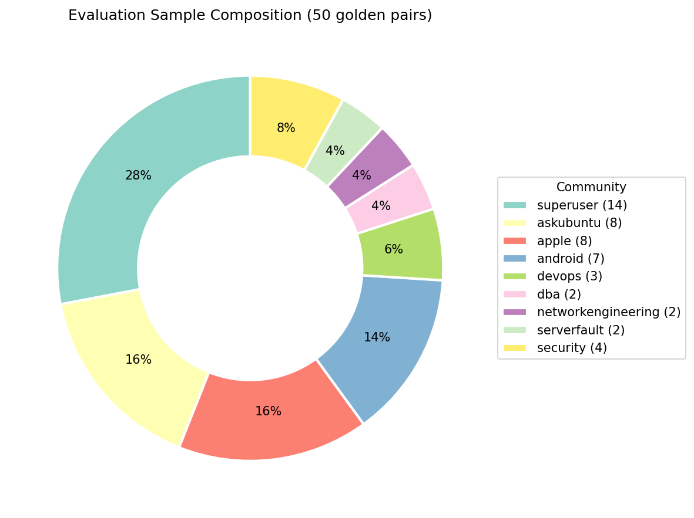
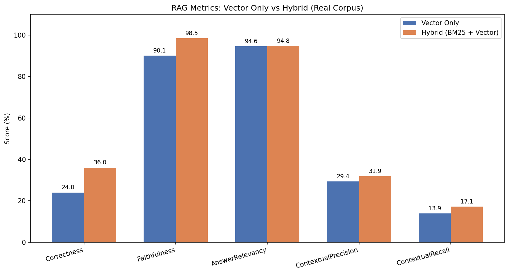
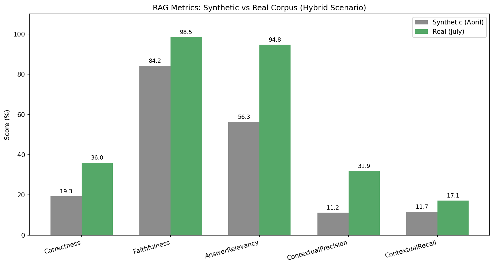

# Synthetic or Real Data? What Changed (and What Didn't) When Migrating a RAG from a Synthetic Corpus to a Real One

The previous two articles — [introduction to the data migration](../0_dataset_migration_intro/dataset_migration_intro_en.md) and [EDA of the Stack Exchange corpus](../1_dataset_migration_EDA/dataset_migration_EDA_en.md) — laid out the problem: a RAG system with modest metrics built on synthetic data. From there, an analysis of a real corpus of approximately 60,000 question-answer pairs from Stack Exchange was carried out as a possible solution. This third article closes the trilogy: the migration is executed and the system is evaluated in its definitive configuration using the corpus generated by real people.

In the first article of this trilogy I put forward an uncomfortable hypothesis: that the RAG's problem was not the architecture, but the raw material. LLM-generated synthetic data can suffer from a perfection the real world does not contain, and that artificial perfection turns simple metrics into impossible chimeras. The exploratory analysis of the second article validated the viability of the real corpus. This article closes the loop: the hypothesis was confirmed, and with compelling numbers.

### Building the Golden Dataset

To evaluate the system, we built a golden dataset of 200 question-answer pairs randomly sampled from the real corpus, with `seed=42` to guarantee reproducibility. The sampling was **stratified by community**, with quotas proportional to a notion of each community's relevance for Level 1 IT support that also avoids underrepresenting small communities — such as the `devops` case discussed during the EDA. The stratification is shown in the following table:

| Community | Pairs | Category | Percentage |
|-----------|------:|----------|-----------|
| superuser | 50 | Hardware / Office | 25% |
| askubuntu | 50 | OS / General | 25% |
| apple | 25 | MDM / Mobility | 12.5% |
| android | 25 | MDM / Mobility | 12.5% |
| serverfault | 15 | DevOps / Infra | 7.5% |
| dba | 10 | Data & SQL | 5% |
| networkengineering | 10 | Networking | 5% |
| security | 10 | Cybersecurity | 5% |
| devops | 5 | DevOps | 2.5% |

Stratification guarantees that all topic areas of support are represented, without the massive communities (superuser, askubuntu) completely dominating the sample. First, only 50 pairs of the golden dataset were used, shuffled in such a way that they were representative of the 9 communities. Then, two scenarios were evaluated: purely vectorial search and hybrid search (Semantic + BM25). In the first scenario we should see how good semantic search is, while in the second we should observe whether traditional keyword search adds value to the system.

All golden pairs are excluded from the vector index and the BM25 index. This guarantees that the system can never retrieve the exact document of the evaluated question: retrieval metrics measure the ability to find the most relevant document by similarity, not to obtain a literal match. It is a bounded form of generalization — while the generator LLM, trained on public data, might recognize well-known StackExchange problems, the retriever cannot rely on exact matching.

## Evaluation Metrics

To evaluate the RAG, the [DeepEval](https://github.com/hwchase17/deepeval) library was used, with five metrics that diagnose different stages of the pipeline:

| Metric | What it measures | Stage it diagnoses |
|---------|------------------|-------------------|
| **Correctness** | Is the generated answer factually correct according to the expected answer? | End-to-end |
| **Faithfulness** | Is the generated answer grounded in the retrieved context or does it hallucinate? | Generation |
| **AnswerRelevancy** | Is the generated answer relevant to the question? | Generation |
| **ContextualPrecision** | Is the retrieved context relevant to the question? | Retrieval |
| **ContextualRecall** | Does the retrieved context cover the information the expected answer mentions? | Retrieval |

An important distinction: the last two metrics evaluate the *retriever* (how well it finds documents), while Faithfulness and AnswerRelevancy evaluate the generator (how well it uses that context) and Correctness evaluates the complete system.

> **A side note on the journey.** The first pass of this evaluation returned 0.00% ContextualPrecision in the purely vector search scenario. An absolute zero across 50 questions is not something a low-quality system produces — it is a loud warning that something is broken. With that in mind, I audited the retrieval chain and confirmed that the semantic search was not running against the real corpus: it was querying an empty Pinecone *namespace*. The connection bugs were fixed and the evaluation was rerun. The numbers in this article are from that corrected run, and the zeros remained as a fresh reminder that, in statistics, overly exact metrics indicate deep problems rather than real results.

## Results

The design of this comparison is deliberately conservative: between the April synthetic baseline and this run, the only change was the corpus. Same pipeline, same retriever, same evaluation methodology, same judge. Everything else held constant, all five metrics went up. That is what makes the migration conclusive: the raw material was the problem.

| Metric | Vector Only | Hybrid (BM25 + Vector) |
|---------|:-----------:|:----------------------:|
| Correctness | 24.00% | **36.00%** |
| Faithfulness | 90.10% | **98.47%** |
| AnswerRelevancy | 94.57% | **94.76%** |
| ContextualPrecision | 29.37% | **31.88%** |
| ContextualRecall | 13.86% | **17.15%** |

### Comparison with the synthetic baseline

| Specification | Synthetic (April) | Real (corrected) |
|:--------------|:---:|:---:|
| Documents in the index | 750 | **60,161** |
| Golden pairs excluded | ✅ Yes | ✅ Yes |
| Generator model | Llama 3.1 8B | DeepSeek V4 Flash |
| | | |
| Correctness (Hybrid) | 19.33% | **36.00%** |
| Faithfulness (Hybrid) | 84.24% | **98.47%** |
| AnswerRelevancy (Hybrid) | 56.31% | **94.76%** |
| ContextualPrecision (Hybrid) | 11.19% | **31.88%** |
| ContextualRecall (Hybrid) | 11.67% | **17.15%** |

### What these metrics mean

**Correctness 36.00%**: it surpasses the synthetic baseline (19.33%) and does so under more demanding conditions, since we are now measuring generalization over real StackExchange answers written by humans. More than one in three generated answers is considered factually correct by the judge.

**Faithfulness 98.47%**: across the 50 evaluated cases, the generated answer was grounded in the retrieved context. This metric deserves two caveats:

1. **The judge and the generator are the same model** (`deepseek/deepseek-v4-flash`). This introduces a self-evaluation bias: a model tends to be lenient with answers from its own family. The real Faithfulness could be somewhat lower with an independent judge. Having a judge different from the generator is a methodological limitation to fix in a future iteration, since this one was intended as a first measurement of the changes and prioritized cost efficiency.

2. **Faithfulness measures generation but is contingent on the RAG pipeline working as such**: whether the LLM uses the retrieved evidence instead of answering from memory or inventing is also captured by this metric. If the model ignored the context and gave a hallucinated answer, Faithfulness would be low even for a powerful model. Therefore, the high value indicates that the *retrieve and generate on what was retrieved* flow is respected — central for a RAG.

**AnswerRelevancy 94.76%**: almost 19 out of 20 answers are relevant to the user's question. A substantial improvement over the synthetic baseline (56.31%) that confirms the generation is aligned with the Q&A format.

**ContextualPrecision 31.88% and ContextualRecall 17.15%**: compared with the April synthetic baseline (11.19% and 11.67%), contextual precision nearly triples and recall grows by more than five points. Semantic search works on its own (vector-only reaches 29.37% contextual precision) and BM25 adds an additional lexical complement of almost 2.5 points. Precision is not perfect because the system retrieves documents *similar* to the question but never the exact document (this happens because the golden pairs are excluded from the index).

With retrieval already operational, the logical next step is to push these metrics higher. `all-minilm:22m` (384 dimensions) was a pragmatic choice for the synthetic prototype, but the semantic ability to distinguish nuances in a technical corpus is expected to be greater with more advanced models and higher-dimensional embeddings. The next phase will evaluate modern models such as `voyage-4-lite` (1024 dimensions) along with different chunking strategies, from removing chunking entirely to trying wider windows. Finding the combination that maximizes retriever precision without touching the rest of the pipeline will be the goal.

### An infrastructure finding: the BM25 index doesn't fit in production

The migration brought an unexpected problem: **the BM25 index ceased to be viable for the deployed version** given the infrastructure we had been working with. With the synthetic corpus (750 documents) the index weighed a few hundred kilobytes, while now, with the 60,000 real pairs, the index file for lexical BM25 search grew to **125 MB**.

The practical result is that **hybrid search (BM25 + Vector) only works in the local development environment**. Although retrieval works relatively well with semantic search (29.37% ContextualPrecision), the hybrid adds a valuable lexical complement (31.88%) that would be lost in production. Faced with this situation, one possibility arises: **move lexical search to MongoDB Atlas**, since we already have the data there and BM25 is also used for that search, so enabling hybrid search in production involves a few code changes.

Eventually, MongoDB Atlas could also handle semantic search, but that will be evaluated once semantic search is optimized and no longer depends on BM25 to meet retrieval requirements.

### Conclusions

**1. The trilogy's hypothesis was confirmed: the raw material was the problem.** The complete system, with the real corpus and in its current configuration, outperforms the synthetic system in Correctness (36.00% vs 19.33%) and improves dramatically in Faithfulness (98.47% vs 84.24%) and AnswerRelevancy (94.76% vs 56.31%). With 80 times more documents and real questions written by humans, the system responds better, not worse. As was thought from the beginning, synthetic data was a problem and real data the solution.

**2. The system generates answers almost without hallucinations.** Faithfulness 98.47% in the hybrid scenario, 90.10% even in Vector Only. The *retrieve and generate on what was retrieved* pipeline is respected. The caveat: the judge and the generator are the same model, which can slightly inflate the number — validating with an independent judge is a pending task.

**3. Retrieval is the new strong point of the pipeline.** Real-corpus retrieval nearly triples the synthetic baseline (ContextualPrecision 31.88% vs 11.19%) and semantic search works on its own (29.37% in vector-only). The next phase (Search Optimization) will evaluate whether modern models such as `voyage-4-lite` (1024 dimensions) and chunking strategies can push these metrics even further.

### References

- [Article 1: Introduction to the data migration](../0_dataset_migration_intro/dataset_migration_intro_en.md)
- [Article 2: EDA of the Stack Exchange corpus](../1_dataset_migration_EDA/dataset_migration_EDA_en.md)
- [Full results in CSV](logs/comparison_20260803_definitive.csv)
